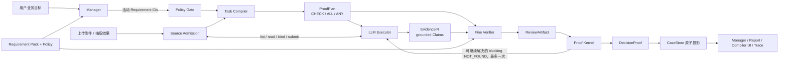

# Evidence Compiler Runtime 冻结说明（2026-08-21）

> 本文件冻结的是 `codex/compiler-runtime-rebuild` 分支在进入正式 Business Eval / Benchmark 阶段前的实现状态。包含本文件的提交即为本次冻结提交。

## 1. 为什么做这个 Compiler

这里的 Compiler 不是 ERP 规则引擎，也不是用 Python 替代 LLM 判断。

它要解决的问题是：企业审核任务通常是开放式自然语言任务。直接把附件和 Policy 一次性交给 Reviewer，模型很容易漏问题、混淆缺证据与反证、引用失真，失败后也很难判断错在规划、取证、验证还是状态落盘。

当前 Compiler 的定义是：

> 把 `Requirement + Policy + 可用来源目录` 编译为有边界、可执行、可核查、可停止的 LLM 工作程序；让 LLM 在证据沙箱内保持语义判断自由度，再用来源、引用、政策和三值逻辑边界验收它的工作。

核心研究问题不是“能写多少业务 DAG”，而是：

> 同一个 Compiler Runtime，能否让同一个模型在不同 ERP 证据审核任务上更可靠、可追踪，并在证据不足时安全保留未知？

## 2. 当前完整链路



对 Manager 暴露的工具名仍是 `evidence_reviewer`，但内部已经是 `EvidenceCompilerRuntime`。没有旧 Reviewer、legacy/shadow 双轨或第二套案件状态链。

## 3. 当前版本标识

| 组件 | 冻结版本 |
|---|---|
| Compiler Runtime | `evidence_compiler_runtime_v2` |
| Task Compiler Prompt | `task_compiler_v8` |
| Executor Prompt | `evidence_executor_v4` |
| Fine Verifier Prompt | `fine_verifier_v9` |
| Manager Prompt | `supervisor_planner_v2.4_native_tools` |
| Demo Policy | `aurora_ap_lite_v1` |
| Requirement Pack | `aurora_requirement_pack_v1` |

实现入口：

- `backend/app/compiler_runtime/runtime.py`
- `backend/app/compiler_runtime/models.py`
- `backend/app/compiler_runtime/sandbox.py`
- `backend/app/compiler_runtime/kernel.py`
- `backend/app/compiler_runtime/policy.py`
- `backend/app/runtime/turn_runner.py`
- `backend/app/state/case_store.py`
- `policies/aurora_ap_policy_v1.json`

## 4. 四个阶段的职责

### 4.1 Manager 与 Policy Gate：选择业务范围

Manager 负责理解用户要完成的业务、与用户沟通、选择活动 Requirement，并决定后续是否调用补料 Advisor、Compiler 或 Report Writer。

Policy Pack 决定某个业务范围的最低审核合同。当前单发票审核不能通过用户措辞跳过内部计算：任何包含 `invoice` 的标准审核范围必须同时包含 `invoice_calculation_valid`。这属于本地政策边界，不依赖用户说出“字段完整性”或“计算一致性”等专业词。

当前 demo Policy 已配置：

- 发票内部算术绝对舍入容差：`0.01 document_currency`；
- 三单金额匹配容差：`2%`；
- 可比较 coverage 当前只允许 `full`；
- 重复付款窗口、审批额度、数量容差、税务管辖规则等多项正式企业值仍未配置。

因此当前 Policy 只是 demo tenant 假设，不是生产企业政策。未配置值必须形成 `NOT_FOUND`，禁止模型用常识补齐。

### 4.2 Task Compiler：把任务编译为 ProofPlan

Task Compiler 每次显式审核只生成一次 `ProofPlan`。

输入包括：

- 活动 Requirement 定义与 planning hints；
- 适用 Policy 摘要；
- 来源类型目录与简短抽取形状；
- 要求原样覆盖的 Requirement IDs 和 Policy refs。

输出节点只允许：

- `CHECK`：一个能够独立核查的命题；
- `ALL`：全部子命题成立；
- `ANY`：至少一个子命题成立。

当前已经删除 `NOT` 节点。正向 Requirement 必须由同极性的正向命题证明，不能用双重否定或“未发现风险”偷换目标。

本地代码只检查：

- 每个活动 Requirement 有且只有一个 root；
- CHECK 必须有 statement 和 Requirement refs；
- aggregate 只能持有依赖；
- Policy/Requirement 引用完整；
- 所有节点都可达、无环、ID 唯一；
- Plan 不得改变 Manager 选择的范围。

业务问题如何拆分仍由模型完成。代码中没有金额、重复付款、供应商、银行等 Requirement 专用 DAG。

发票内部算术当前要求拆成四个原子层次：

1. 数量 × 单价与行金额；
2. 行金额合计与票面小计；
3. 税、折扣、附加费用；
4. 小计加减上述项目与票面最终总额。

这项约束是通用 capability guidance，不是针对某一张黄金发票写死数值。

### 4.3 Executor：在证据沙箱中自主工作

Executor 是主要语义 Worker。它读取 ProofPlan 后自行决定读哪些来源、绑定哪些事实、如何理解实体关系、经济范围、金额 basis、coverage 与生命周期。

第一版只开放四个工具：

- `list_sources`
- `read_source`
- `bind_claim`
- `submit_check`

硬边界：

- 来源必须先读后绑；
- Claim 必须包含 exact quote、locator 和已准入 source ID；
- quote 必须逐字存在于文档正文或只读 `system_provenance`；
- Claim 只能追加，不能原地修改；
- 同语义 Claim 可幂等复用，ID 冲突 fail closed；
- CHECK 只能引用本轮已采纳 Claim；
- 不提供 Shell、Python、任意文件系统、Policy 写入、CaseStore 写入或 DecisionProof 修改权限。

`system_provenance` 只证明系统内上传链：附件身份、相对路径、内容哈希、抽取/预览 locator 和来源准入。它不能证明现实世界中文件真实、未篡改、已授权或已审批。

Executor 最多六个模型 turns。正常目标是三批工具动作：批量读源、批量绑定 Claim、批量提交 CHECK。达到预算时保留已采纳工作，未完成部分继续保持未知。

### 4.4 Fine Verifier：独立核查原子命题

Fine Verifier 一次批量检查全部 CHECK。它收到：

- 原子命题；
- 该 CHECK 自己的 submitted Claim refs；
- 对应候选 Claims；
- 全部已准入来源正文与系统 provenance；
- 适用 Policy。

它不接收 Worker 的最终 verdict，也不能借用提交给其他 CHECK 的 Claim。

每个 CHECK 只能输出：

- `SUPPORTED`
- `CONTRADICTED`
- `NOT_FOUND`

强结论必须覆盖全部准入来源快照，并引用已提交、已落源的 Claim。相关但不充分、低置信度、来源漏读、Policy 未配置、事实歧义或冲突都只能是 `NOT_FOUND`。

算术、reconciliation 和 lifecycle 关系允许 Verifier 基于多个 grounded 输入进行推导；派生差额不要求原文逐字写出，但每一个输入必须落源，并在 reason 中解释推导。

为避免自回归模型“先填 status、后完成计算”，`CheckAssessment.status` 位于结构化输出最后，Prompt 要求 reason 最后写明确的 `Final classification`。Runtime 只在模型自己明确给出的终态与 status 唯一冲突时对齐两者；Kernel 仍保留 `ASSESSMENT_STATUS_REASON_CONFLICT` fail-closed 边界。这不是金额规则，也不根据模糊自然语言猜 verdict。

## 5. ReviewArtifact、Proof Kernel 与三值语义

`ReviewArtifact` 保存本轮模型工作的可重放快照：

- ProofPlan 与 plan hash；
- EvidenceIR、source fingerprints 与 evidence snapshot hash；
- 每个 CHECK 的 submissions 和 assessments；
- Policy hash 与未配置 Policy refs；
- Compiler、模型和 Prompt 版本。

当前版本字段用于审计，不参与 CaseStore 的自动失效判断。升级 Compiler、模型或 Prompt 后，需要显式重新发起审核，不能假设旧案件会仅因版本号变化自动重编译。

共享 IR 的范围是同一次显式审核：本轮全部活动 Requirement 和最多一次主动验证共用同一个 EvidenceIR。下一次显式审核会从当时全部 active sources 重新建立 IR，目前没有跨运行增量 Claim 缓存。

`CompiledProof` 是由 Kernel 纯计算得到的派生物，只包含：

- `NodeResult`
- `DecisionProof`
- `ProofObligation`
- `CompilationDiagnostic`

Kernel 不判断金额语义、供应商身份或生命周期。它只负责引用、来源、Policy、哈希和三值传播。

聚合规则：

- `ALL`：任一 `CONTRADICTED` 即反驳；全部 `SUPPORTED` 才支持；其余为 `NOT_FOUND`；
- `ANY`：任一 `SUPPORTED` 即支持；全部 `CONTRADICTED` 才反驳；其余为 `NOT_FOUND`。

以下情况一律安全降级为 `NOT_FOUND`：

- stale Plan / Evidence snapshot；
- Policy 未配置；
- CHECK 未提交或 assessment 缺失；
- Claim/source 悬空或越权引用；
- 强结论没有 Claim、source、quote 或完整来源覆盖；
- 使用未提交给该 CHECK 的 Claim；
- low-confidence Claim 支撑强结论；
- Verifier status 与明确终态仍不一致。

## 6. 主动验证循环

首轮 Kernel 生成 blocking obligations 后，Runtime 只对仍有可能通过现有来源解决的 CHECK 再运行一次 Executor + Verifier。

不会重试：

- 已经确定为 SUPPORTED/CONTRADICTED 的 root；
- optional Requirement 的非阻塞缺口；
- 单纯由未配置 Policy 导致的缺口；
- 没有新 Claim 或新的 CHECK-Claim 关联的空转。

当前最多一轮主动验证。以后可研究贝叶斯校准器决定“是否值得再验证”，但校准器不能参与事实真伪或 Kernel 三值传播。

## 7. CaseStore：单一状态投影

CaseStore 的刷新顺序是：

```text
Requirement 规范化
→ premise/derived activation
→ attachment manifest 与可信来源
→ supersession / active evidence
→ Artifact hash 与 Policy 校验
→ Kernel 重编译
→ Requirement 状态投影
→ risk/questions/buckets/workflow status
```

`CaseStore.load()` 和普通刷新绝不调用模型。Evidence、Requirement、Policy 或 source fingerprint 改变时，旧 Artifact 失效，`compiled_proof` 清空，Requirement 安全回落到 `missing/weak`，等待下一次显式 Compiler 运行。

投影规则：

| DecisionProof | Requirement |
|---|---|
| evidence owner + `SUPPORTED` | `accepted` |
| other owner + `SUPPORTED` | `satisfied` |
| `CONTRADICTED` | `conflict` |
| `NOT_FOUND` 且有相关来源 | `weak` |
| `NOT_FOUND` 且无相关来源 | `missing` |

风险和 next questions 每次从当前 canonical proof 重算，不再与历史 Patch 结果做永久 union。支持/冲突引用按 DecisionProof 的同极性叶 CHECK 投影，避免 aggregate root 把正反来源混在一起。

`CONTRADICTED` 表示证据已足以报告冲突，因此可以进入报告；required `NOT_FOUND` 会阻塞报告；optional `NOT_FOUND` 保留记录但不阻塞案件。

这套系统仍不输出企业正式 `APPROVE/REJECT`。

## 8. Manager、报告、HITL 与前端 Trace

- Manager 是唯一面向用户的协调者，负责业务沟通、范围选择、补料说明和是否请求报告。
- Advisor 只收到紧凑 Requirement、Proof obligation 和准入来源摘要，不再读取完整 EvidenceIR 或原始全文。
- Report Writer 只消费 canonical DecisionProof、来源链和投影后的案件事实，不重新解释 ProofPlan 或未准入附件。
- 写 Markdown 和渲染 PDF 仍经过 HITL；审批 checkpoint 是一次性消费，旧审批不能复活。
- 同一案件只允许一个活动 run；不同案件的前端运行状态、附件、SSE、审批和 optimistic message 按 case ID 隔离。
- 前端 Compiler 页直接展示 Plan、EvidenceIR、Assessments、DecisionProof、obligations 和 diagnostics。
- 调试页按 Plan → Work → Verify → Proof → Commit 展示公开工作进度；不会暴露隐藏思维链。

真实 provider call 的人读记录位于：

```text
workspace/cases/<case_id>/traces/<run_id>/deepseek_calls.txt
```

`events.jsonl` 是 canonical trace；TXT 是脱敏的人读投影。Provider API requests 与逻辑 role calls 分开统计。

## 9. 当前已经验证的关键行为

- Task Compiler 的 schema、无环、root/Policy/Requirement 覆盖；
- read-before-bind、quote/locator、来源准入和 append-only IR；
- 全来源覆盖、CHECK submission 隔离和低置信度 fail closed；
- `SUPPORTED / CONTRADICTED / NOT_FOUND` 的 ALL/ANY 传播；
- stale Artifact、Policy 缺失和来源 fingerprint 变化后的安全失效；
- optional obligation 不阻塞报告；
- 发票内部四层算术 Plan 与 `0.01` 舍入政策；
- Verifier 明确终态与结构化 status 的一致性边界；
- CaseStore 原子投影、风险清理、报告冲突 guard；
- 附件持久展示、多案件前端隔离、SSE、双审批和 stale approval 防复活；
- provider call 与 `deepseek_calls.txt` block 对账、Prompt 版本与 usage 记录。

本次冻结前的本地验收结果：

- 后端冻结提交范围：`565 passed`（完整工作区另有 4 个即将废弃的旧单案 Eval 实验测试，本次不提交）；
- 最终 Manager Prompt / Context / Transcript 定向回归：`40 passed`；
- Desktop Node tests：`5 passed`；
- Renderer tests：`60 passed`；
- Desktop + Renderer TypeScript typecheck：通过；
- Electron/Vite production build：通过；
- Python `compileall`：通过；
- `git diff --check`：通过。

以上是冻结时点的基线，不应被理解为未来修改后的永久保证；真实模型 canary 与正式 Business Eval 仍需单独运行。

## 10. 已知限制

1. 当前模型调用和上下文仍然偏重。正确性稳定前没有为了省 token 大幅删上下文。
2. Task Compiler 和 Verifier 仍是模型阶段，可能生成无效结构或错误语义；当前边界主要负责 fail closed，不保证每次自动恢复。
3. Verifier 的明确终态对齐只解决“模型自己在 reason 中给出唯一终态但 status 抄错”的协议错误，不是通用自然语言裁判器。
4. 主动验证固定最多一次；还没有贝叶斯校准、动态验证预算或人工升级流。
5. 多项真实企业 Policy 未配置，因此相关任务按设计会停在 `NOT_FOUND`。
6. 上游附件抽取质量仍会影响 Worker 可见证据；Compiler 不能凭空修复 OCR 或缺页。
7. 当前 public invoice corpus 和单案例 scorer 是 Benchmark 前置资产，不代表正式架构 Benchmark 已完成。
8. 旧 Shared-IR / NOT-node Artifact 不兼容当前 schema；这是直接替换设计，不保留迁移双轨。
9. 当前系统输出的是 proof-carrying review evidence，不是企业审批决定。
10. Compiler/model/Prompt 版本目前只记录在 Artifact 中，不自动使旧 Artifact 失效；版本升级后要显式重跑案件。
11. Manager Prompt 已要求在算术冲突时明确报告票面值、重算值和差额，但常规写 Patch 后可能由确定性 `_runtime_final_answer` 直接收尾；该适配器目前不保证携带 grounded 数值。报告链能读取 canonical Claims，聊天收尾仍需由 Benchmark 验证后再决定是否补最小投影。

## 11. Benchmark 阶段的边界

冻结后先做 Eval / Benchmark，不继续堆 Compiler 行为。

正式业务 Eval 必须允许不同中间路径。官方成功条件应围绕：

```text
business_pass =
    业务事实与最终结论正确
    AND DecisionProof 三态正确
    AND 强结论证据边界成立
    AND 无 Policy/权限/Oracle 泄漏
    AND 用户得到必要业务信息
```

以下内容只能作为诊断，不应默认决定业务通过：

- CHECK 的具体 ID、数量和文本；
- root 是否恰好长成某个参考 Plan；
- 工具调用顺序；
- Prompt 文案；
- Verifier reason 的固定关键词；
- 数字千分位和其他等价格式。

工程指标单独报告，不与正确性换算成一个总分：

- provider requests 与逻辑 role calls；
- 分阶段 input/cached/reasoning/output tokens；
- 上下文构成、重复率与有效证据占比；
- TTFT、总耗时、阶段 p50/p95、重试和工具错误；
- cost/task、cost/passed task；
- 同案重复运行的 `pass^k` 与语义变体一致性。

当前路径绑定的单案 Eval 实验不属于本次冻结契约，也不随本次冻结提交发布。它暴露出的 Plan/root/statement/exact-quote/tool-order 断言问题只作为设计经验保留；下一阶段直接从一个路径无关的业务案例 Eval 重新实现，不在旧 scorer 上继续叠兼容层。

## 12. 继续开发前的原则

1. 先用固定案例查看真实模型的 Plan、工具输出、Claims、Assessments 和最终回复，再决定下一处改动。
2. 一次只改一个阶段或一个边界；失败后固定重跑同一案例，不通过换案例逃避问题。
3. 不根据某个黄金答案写 Requirement ID 特判、金额特判或专用 DAG。
4. 新 Requirement 优先证明同一 Task Compiler + Executor + Verifier + Kernel 能复用，而不是新增 Agent。
5. 先比较业务结果和 false strong conclusion，再讨论 token/latency 优化。
6. Benchmark expected/oracle 永远不能进入模型上下文。
7. 在 Benchmark 给出证据前，不重新引入旧 Contract/Hole/Proposal、SemanticGraphSpec、legacy reviewer 或第二套状态投影。
8. 不继续维护或兼容旧单案 scorer；先把一个真实“业务挖坑”做成结果导向的 Eval，再复制这种形态扩展为 Benchmark。

这就是 Benchmark 开始前需要保留的 Compiler 基线。
