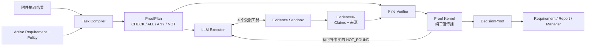

# Lightweight Evidence Compiler

这个项目里的 Compiler 不是规则引擎，也不是把 Reviewer 的判断换成 Python。

它的职责只有一句话：

> 把开放式企业审核任务编译成一份可执行、可核查、可停止的 LLM 工作程序。

同一个 DeepSeek Worker 可以处理金额核对、供应商状态、重复付款或其他 ERP Requirement；变化的是本轮 `ProofPlan` 和证据上下文，不是 Agent 数量，也不是一张新的手写业务 DAG。

## 运行链路



一次显式 `evidence_reviewer` 调用完成这条链。对 Manager 而言工具名没有变化；工具内部已经不是旧 Reviewer，而是 `EvidenceCompilerRuntime`。

`CaseStore.load()` 和普通 Requirement 刷新永远不调用模型。Evidence、Requirement 或 Policy 变化后，旧 Artifact 会失效，Requirement 安全回落为 `missing/weak`，等待下一次显式审核。

## 四个核心对象

### `ProofPlan`

Task Compiler 接收当前活动 Requirement、版本化 Policy 摘要，以及按文档类型聚合后的来源/抽取形状，一次生成本轮计划。规划输入不包含 `source_id`、文件名或附件名，因此 Plan 不会提前选择证据，也不会因为运行期来源 ID 改名而改变语义。

计划只有四种节点：

- `CHECK`：一个可以单独核查的命题；
- `ALL`：全部子命题成立；
- `ANY`：至少一个子命题成立；
- `NOT`：对子命题取三值否定。

本地代码只验证唯一 ID、引用完整、Requirement/Policy 覆盖、根节点完整和无环。它不替模型决定应该如何拆业务问题，也不在代码中按金额、供应商或重复付款 ID 建专用 DAG。

`ProofPlan` 的价值是把“审核一下有没有重复付款”变成一组带完成条件的工作问题。计划错了，可以只调 Task Compiler；不需要同时猜 Worker、Verifier 或 CaseStore 哪里错了。

### `EvidenceIR`

Executor 在证据沙箱中自主列来源、读材料、理解实体和经济语义，再绑定 Claim：

```text
subject / predicate / value
+ source_id / exact quote / locator / confidence
```

第一版沙箱只开放：

- `list_sources`
- `read_source`
- `bind_claim`
- `submit_check`

来源未读、quote 不是原文子串、locator 无效、Claim 引用悬空时，工具返回可修复错误，模型可以在同一小循环中改正。沙箱不提供 Shell、Python、任意文件、Policy 写入、CaseStore 写入或 DecisionProof 修改能力。

Claim 只能追加，不能原地改写。同一来源正文和 SHA-256 必须一致；重放时正文被截断或变化会使 Artifact 失效。

### `CheckAssessment`

Fine Verifier 独立核查每个 `CHECK`，只输出：

- `SUPPORTED`
- `CONTRADICTED`
- `NOT_FOUND`

Verifier 看原子问题、该检查已提交的 Claims、全部准入来源正文、精确引用和 Policy，不看 Worker 的最终 verdict。Claim 的 predicate/value 只是 Worker 提议；Verifier 必须重新检查 quote 是否真的蕴含该语义。相关但不充分的事实不能形成强结论。

强结论必须引用已进入 IR 且由 Executor 提交给该检查的 Claim，并明确检查完整个准入来源快照。缺失、部分、歧义、低置信度、来源漏读、互相冲突或 Policy 未配置都只能是 `NOT_FOUND`。

文档类型只能证明“这是一份发票/采购订单等文档”，不能自动证明原件、真实性、审批、授权或生命周期状态。比如 `invoice` 表示“发票文档”；若要证明原件可追溯性，必须单独激活 `source_traceability` 并提供直接证据。

### `ReviewArtifact` 与 `DecisionProof`

`ReviewArtifact` 保存本轮可重放的模型工作：Plan、EvidenceIR、Assessments、Policy hash、Evidence snapshot hash、Compiler/模型/Prompt 版本。

它不是第二套 Requirement 状态。`Proof Kernel` 从 Artifact 纯计算得到 `DecisionProof`；派生结果只保存节点、决定、义务和诊断，不再复制 Plan、IR 或 Assessments：

- `ALL`：任一反驳即反驳；全部支持才支持；其他为未知；
- `ANY`：任一支持即支持；全部反驳才反驳；其他为未知；
- `NOT`：支持与反驳互换，未知仍未知；
- 引用、来源或哈希不完整时一律降为 `NOT_FOUND`。

CaseStore 只投影根结论：

| DecisionProof | Requirement 状态 |
|---|---|
| evidence owner + `SUPPORTED` | `accepted` |
| other owner + `SUPPORTED` | `satisfied` |
| `CONTRADICTED` | `conflict` |
| `NOT_FOUND` 且有部分来源 | `weak` |
| `NOT_FOUND` 且无来源 | `missing` |

这些状态用于证据报告，不是企业正式 `APPROVE/REJECT`。

## 主动验证循环

首轮 Verifier 出现 `NOT_FOUND` 时，Runtime 只把可由现有来源继续解决的检查、缺失事实和 Hook 反馈交还 Executor。

第二轮的停止条件是：本轮目标检查必须产生新的 `submit_check`；第一轮旧提交不能让 Completion Hook 提前结束。只有新增有效 Claim，或把已有 Claim 重新关联到未决检查时，才再次调用 Verifier。没有新的有效工作、Policy 本身未配置或达到预算时，保留 `NOT_FOUND`。

当前固定最多一轮主动验证。以后贝叶斯校准器只替换“是否值得再跑一轮”的触发器，不参与事实真伪，也不改变 Kernel。

## LLM 与确定性代码的边界

LLM 负责：

- 如何把 Requirement 拆成可核查问题；
- 阅读材料并识别文档、实体、关系和经济范围；
- 金额口径、生命周期、授权语义和歧义判断；
- 证据不足时明确保留未知。

确定性代码只负责：

- 来源可访问范围和 read-before-bind；
- quote、locator、ID、hash 与引用完整性；
- Plan schema、无环和覆盖；
- 三值逻辑传播、预算、停止条件与状态投影；
- Patch 的原子写入和权限边界。

判断代码中不应出现按 `three_way_amount_match`、`no_active_duplicate`、供应商或银行 Requirement ID 分支构造业务结论。Requirement/Policy 数据可以拆卸，Agent 生命周期保持不变。

## 调试方法

每次真实案件运行会生成：

```text
workspace/cases/<case_id>/traces/<run_id>/deepseek_calls.txt
```

TXT 按真实 provider call 记录可见的 system prompt、输入、输出、工具参数/结果、usage、request id 和错误；隐藏思维链与密钥不会写入。`events.jsonl` 仍是 canonical trace，TXT 只是人读投影。

排错顺序固定：

1. Plan 是否漏问题、提前下结论或错误使用 Policy；
2. Executor 是否真的读源，Claim quote/locator 是否落源；
3. Source Hook 是否正确拒绝并把反馈交还模型；
4. Verifier 是否独立核查 quote，而不是复述 Claim 标签；
5. Kernel 是否只做引用与三值传播；
6. CaseStore 的 source/policy/hash 是否与 Artifact 完全一致。

开发时每层先跑离线测试，再只调用一个固定 canary。失败后不换案例，只改一个变量并查看 TXT。最终 holdout 的 expected 只包含业务真值、必要来源和目标状态，绝不能进入模型上下文。

## 明确不做

- 不增加业务 Agent、图数据库、万能 Ontology 或规则 DSL；
- 不保留 legacy/shadow 双轨；
- 不让 CaseStore 在读取时调用模型；
- 不让 Manager、Patch 或 Agent 修改 Plan、IR、Assessment、Artifact 或 DecisionProof；
- 不在第一版加入人工升级流、增量缓存或贝叶斯校准器；
- 不把“测试通过”当作真实模型输出已经正确。
