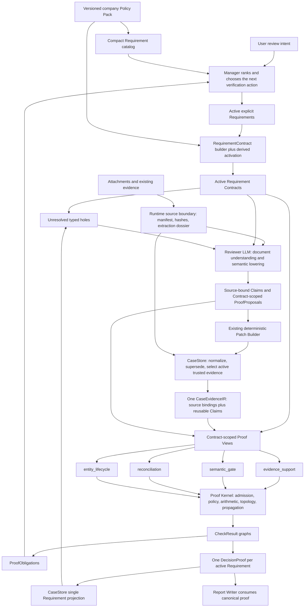

# Proof-Directed Shared Evidence IR

The Compiler is a derived business-state projection inside `CaseStore`. It is not a new Agent, runtime phase, scheduler, graph database, rule DSL, or source of truth. Agents may propose source-bound Claims and `ProofProposal`s; they cannot patch `compiled_proof`.

The core shape is **one case-level `CaseEvidenceIR`, with multiple Contract-scoped Proof Views generated on demand**. We do not build a new independent DAG for every case or teach the Runtime a growing list of invoice-specific prompts.

## Current architecture

The loop matters: a new source, correction, supersession, Requirement, Policy value, Claim, Proposal, or Compiler version causes a full recompile. `compiled_proof` is therefore a disposable snapshot, not a second truth store.

## Canonical objects

### `CaseEvidenceIR`

Each case has one shared IR containing:

- trusted, accepted source bindings;
- a source snapshot hash and Predicate Catalog version/hash;
- the predicates requested by active Contracts;
- globally reusable descriptive Claims with typed values, evidence ids, exact quotes, locators, confidence, and optional entity grouping.

The same admitted Claim is lowered once and may be selected by several Proof Views. A Proof View sees only the Claims and Proposals relevant to its Contract, so an unrelated Claim cannot change another Requirement's proof hash.

`CaseEvidenceIR.claims` is the only shared Claim representation exposed by `CompiledProof`; the old top-level Claim/Judgment mirrors have been removed.

### `RequirementContract`

The versioned Policy Pack compiles each active Requirement into a Contract containing its id/hash, proof template, target predicate, required inputs, evidence roles, policy inputs, semantic capability, activation mode, and candidate verification actions. Typed inputs carry an exact source role, value type, optional enum vocabulary, required source-grounded attributes, and entity-scoping semantics. Configured values are injected as a compact read-only `policy_excerpt`; unconfigured values remain policy holes.

Manager chooses the review scope through active Requirements. The local builder validates and instantiates Contracts; neither Manager nor Reviewer may invent a Contract or hard company rule.

Activation is explicit for ordinary Requirements and derived only where the Policy Pack declares stable premises, such as an amount-match or duplicate-control conclusion.

### `TypedHole`

Unresolved Contract inputs are deduplicated by semantic key and exposed to Reviewer as one batch:

- `source`: a trusted supporting source is absent;
- `claim`: a descriptive typed fact is absent;
- `relation`: an entity or economic relationship is unresolved;
- `judgment`: a bounded semantic conclusion is unresolved;
- `policy`: an approved enterprise policy value is not configured.

A policy hole must remain unresolved. Reviewer cannot fill it from RAG, memory, a local session database, or general knowledge.

### Reviewer source language and `ProofProposal`

Reviewer emits `SemanticClaimCandidate` and `SemanticProposalCandidate`. It refers only to Runtime-provided hole ids, packet-local Claim handles, and canonical Claim ids already supplied from the IR. It does not invent Claim ids, Contract ids/hashes, source snapshot hashes, Requirement status, `PROVED`/`DISPROVED`, or repeated full source references.

The model-facing `EvidenceReviewerOutput` is intentionally sparse: one attachment id, source admission judgment, direct supports, Claims, and Proposals per physical document. It cannot emit `EvidenceItem`, metadata, evidence cards, or `CasePatch`. Runtime code binds the attachment id to the manifest/extraction dossier and constructs those storage objects, so the model does not echo OCR bodies or duplicate Runtime-owned provenance.

Reviewer receives compact Contract identity/capability summaries, typed input slots, relevant existing IR Claims, and the complete Typed Holes. A Contract with only a judgment hole therefore still carries the facts needed to repair that judgment. RAG is capped to short guidance excerpts. One call handles the whole current packet; a provider/schema failure may use the SDK's single schema retry, but Manager cannot start another Reviewer call in the same turn.

The Binder resolves `input_handles`, `supporting_handles`, and `opposing_handles` independently against the active Contract, validates quote/locator grounding, assigns canonical Claim ids, and applies `global`, `singleton_by_role`, `same_entity`, or `per_entity` binding. Strong Proposals must explicitly carry their complete input set and polarity; empty, dangling, duplicated, ambiguous, overlapping, or out-of-scope references fail closed. The Kernel consumes canonical `ProofProposal`s directly; there is no second `SemanticJudgment` mirror or legacy Reviewer verdict projection.

### `CompilationDiagnostic`

Rejected candidates are not silently discarded. Diagnostics explain source-binding failures, missing or ungrounded quotes/locators, invalid values or ids, stale Contract/Proposal snapshots, missing entity keys or Policy, blocked dependencies, and shadow mismatches. They reuse Harness tracing and do not create another logging store.

## Four reusable Proof Views

| Proof template | Typical Requirements | LLM-owned work | Kernel-owned work |
|---|---|---|---|
| `evidence_support` | documents, fields, visual checks, risk-check sources | identify the document/field and quote it accurately | trusted-source admission, accepted/full support, provenance |
| `semantic_gate` | field validity, vendor status, bank authorization, approval, SOD, release, tax coding, audit chain | interpret entities, authorization meaning, economic scope, ambiguity | premise coverage, Policy presence, Proposal admission, dependency propagation |
| `reconciliation` | three-way amount/quantity and non-PO contract matching | determine whether records refer to comparable entities, periods, basis, coverage and units | currency/unit/basis gates, configured tolerances, arithmetic, aggregation |
| `entity_lifecycle` | duplicate-payment and payment-hold conclusions | relate candidates, payments, reversals, holds and lifecycle events | candidate isolation, identity constraints, `all/any/none` quantification, propagation |

Amount, quantity, and non-PO controls use the reusable reconciliation builder. Duplicate-payment and payment-Hold controls use the same grouped-lifecycle builder. The authoritative path has no specialized amount or duplicate DAG.

Lifecycle subjects are conditional groups: if a payment or reversal branch appears, all required facts for that branch must be present; an absent optional reversal branch is not itself missing evidence. Policy completeness gates a positive universal claim such as “no active duplicate found”, but cannot erase a source-grounded counterexample. Thus a direct active duplicate may be `DISPROVED` while the search-window Policy is unconfigured, whereas a clean search remains `INCOMPLETE` until that Policy is configured.

These are view shapes, not four Agents. The same Reviewer handles all current holes in one call using a stable protocol plus dynamic Contracts. Adding a Requirement within an existing capability should normally change only the Policy Pack, guidance, and golden cases—not `CaseStore`, Runtime, or the global Reviewer prompt.

## LLM and deterministic boundaries

Reviewer owns work that requires language understanding:

- document and entity recognition;
- source-bound field and Claim extraction;
- cross-document identity and economic-scope interpretation;
- lifecycle, authorization, and ambiguity judgments;
- choosing `UNKNOWN` when the submitted sources do not justify a strong conclusion.

The deterministic layer owns safety and reproducibility:

- source identity, SHA-256 and supersession admission;
- Claim types, ids, quote/locator grounding and deduplication;
- Contract and Policy versions;
- arithmetic, equality, quantifiers, graph topology and three-valued propagation;
- Proposal snapshot validation, diagnostics, proof hashes and Requirement projection.

Deterministic code does not replace semantic reasoning. It prevents a fluent but unsupported model answer from becoming case truth.

## Compilation and CaseStore projection

`CaseStore` has one authoritative path:

1. canonicalize Requirements and ensure declared premises;
2. bind the manifest, verify trusted sources, apply supersession, and select active evidence;
3. build active Contracts and unresolved holes;
4. lower the active packet once into `CaseEvidenceIR`;
5. admit Contract-scoped Proposals and generate one Proof View per active Contract;
6. execute the Kernel and create one root `DecisionProof` per Requirement;
7. derive final Typed Holes from the actual Checks and Decisions, then project only those canonical roots into Requirement status and workflow buckets.

`CaseStore` never promotes a Reviewer's `partial` or absent support to `full`, and extracted-field metadata never creates support records by itself. Generic evidence roles such as approval matrices, SOD records, and audit trails are admitted through the active `evidence_support` Contracts rather than a second hard-coded document path.

Projection is uniform:

| Canonical proof | Requirement projection |
|---|---|
| `PROVED` + `evidence_support` | `accepted` |
| `PROVED` + semantic template | `satisfied` |
| `DISPROVED` | `conflict` |
| `INCOMPLETE` with admitted evidence | `weak` |
| `INCOMPLETE` without admitted evidence | `missing` |

There is no separate Reviewer-status projection, compiler mode, or legacy per-program fallback.

Report Writer consumes `DecisionProof`, Checks, obligations, and the IR provenance chain. Manager consumes blocking obligations and ranked candidate actions. The obligation value surface may rank roughly by `Blocking × Impact × Uncertainty × Resolvability ÷ Cost`, but it never decides whether a Claim is true or executes an action without Manager and Policy Gate control.

Binding diagnostics are routed to Reviewer for at most one repair pass in the same run. A repaired packet is patched and compiled again. A remaining binding failure is reported as an internal semantic-package problem, not converted into a material gap or sent to Materials Advisor. Invalid JSON, a terminal provider/schema failure, or a Reviewer timeout is fail-closed and cannot cause Manager to loop over the same Reviewer call. Runtime extraction never substitutes a regex-derived business review or duplicate-payment conclusion.

## Three-valued proof and outcome

| Proof status | Meaning | Outcome |
|---|---|---|
| `PROVED` | all required premises support the proposition | `EVIDENCE_SUFFICIENT_FOR_REPORT` |
| `DISPROVED` | admissible evidence establishes a failed proposition | `EVIDENCE_SUFFICIENT_FOR_REPORT` |
| `INCOMPLETE` | a required source, Claim, relation, judgment, or Policy value is unresolved | `HOLD_FOR_EVIDENCE` |
| exhausted `INCOMPLETE` | registered verification attempts cannot add admissible Claims | `ABSTAIN_OR_ESCALATE` |

`DISPROVED` is a reportable finding, not a request to keep collecting material until the result becomes a pass. `INCOMPLETE` is not evidence that the proposition is false.

None of these outcomes means payment `APPROVE` or `REJECT`. Formal approval requires a separately versioned approval Policy Pack and an explicit authority model and is intentionally absent.

## Source and admission invariants

- Only active, accepted attachment evidence classified as `business_evidence` may ground Compiler Claims or Proposals.
- RAG, advisory memory, rejected/prompt-injection/cross-case material, ordinary process logs, low-credibility evidence, and unconfigured Policy values cannot establish a strong semantic result. Accepted user-message evidence may support an evidence leaf, but it cannot lower Compiler Claims or Proposals.
- Quotes must occur in the Runtime-owned trusted source corpus and keep a non-empty locator. Missing, mixed, duplicated, ambiguous, or hash-mismatched sources fail closed.
- Claim ids are packet-unique. A Contract view admits a Claim only when its source role, value type, enum vocabulary, required attributes, and entity scope match. Attribute values need their own grounded source or must occur in the Claim quote. Entity keys are opaque grouping tokens, not hidden conclusions or payment-number parsers.
- A strong Proposal requires an exact current Contract, complete relevant Claim coverage, valid supporting/opposing subsets, required confidence, and no open question. Conflicting, stale, source-free, partial, or malformed Proposals yield `INCOMPLETE`.
- Narrative words such as "clarified" or "resolved" cannot clear a Conflict; only a structured `resolution_status` or trusted supersession can do so.
- Supersession is accepted only from one trusted, accepted, same-type correction. Replacing evidence always triggers full recompilation.
- Agents and patches cannot directly modify Contracts, holes, IR, Decisions, or Requirement-derived state.

## Acceptance focus

The Compiler is accepted on behavior, not on the number of framework objects:

- every active Requirement has exactly one root `DecisionProof`;
- a shared Claim is lowered once and reused by multiple Contracts;
- evidence, Claim, and Contract ordering does not change IR or proof;
- an unrelated Claim does not change another Proof View hash;
- every rejected candidate has a primary diagnostic and never enters the IR;
- missing Policy, stale Contract/Proposal, dangling refs, low confidence, and conflicting proposals stay `INCOMPLETE`;
- source-grounded `PROVED`/`DISPROVED` conclusions have complete quote, locator, and trusted-source coverage;
- shadow mode adds no model call and produces no unexplained strong-result mismatch.

Representative golden cases cover amount conflict, partial receipt, complete duplicate reversal, active duplicate, unresolved lifecycle, and the `vendor_identity_active` semantic-gate canary. Normal development uses offline fixtures; limited live-model acceptance is reserved for release gates.

The four release canaries live under `benchmarks/invoice_tau/live_acceptance`, separate from routine scripted discovery. The duplicate-reversal canary remains `INCOMPLETE` in the formal Aurora demo Pack until `duplicate_search_window` is supplied by an approved policy source; its offline configured-policy fixture proves the positive lifecycle branch.

## Deliberate limits

- No graph database, universal ontology, arbitrary textual rule DSL, new Compiler Agent, second CaseStore, or incremental cache.
- The Predicate Catalog remains small and tied to proven ERP capabilities; it grows only for a real Contract.
- Full recompilation is preferred while case sizes are small because it keeps one derived truth path.
- `CompiledProof.decisions`, `decision_for(requirement_id)`, and `evidence_ir.claims` are the only canonical proof surfaces.
- Aurora remains a demo tenant. Values marked unconfigured remain policy holes until supplied by an approved enterprise source.
- The system compiles proof-carrying evidence for reporting; it does not issue a corporate approval decision.
