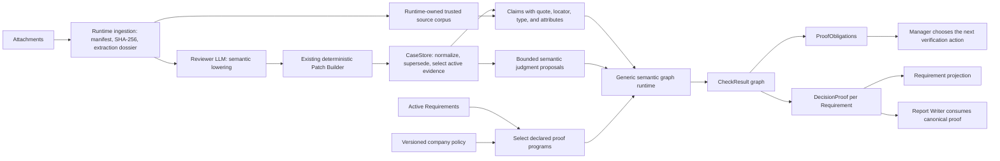

# Proof-Carrying Evidence Compiler v0.3

The Compiler is a derived business-state projection inside `CaseStore`. It is not a new Agent, runtime phase, scheduler, DSL, or source of truth. Agents may propose source-bound semantic IR; they cannot patch `compiled_proof`.

## Current architecture

The Reviewer handles natural-language interpretation. The Compiler validates provenance, claim identity, active-snapshot coverage, policy constraints, and dependency propagation. Deterministic code does not replace the LLM's semantic work; it prevents unsupported or contradictory strong conclusions from becoming case truth.

## Compilation contract

1. A stable input Requirement selects each program. Program activation never depends on whether the model happened to emit either an IR row or the program's derived Requirement.
2. Reviewer lowers source language into candidate Claims and, where the graph requests one, a bounded semantic judgment proposal.
3. The existing Patch Builder preserves the proposal. `compiled_proof` remains unpatchable.
4. CaseStore verifies exact attachment provenance, applies only one accepted `business_evidence` correction of the same evidence type, then passes active evidence plus active Requirement ids to the domain compiler.
5. The Compiler lowers admissible Claims, validates judgments, executes declared nodes in topological order, and creates one `DecisionProof` per program.
6. CaseStore projects each declared `root_check_id` into its Requirement status. No `REQ_*` naming convention is required by Runtime.
7. Manager and Report Writer consume canonical decisions and obligations instead of re-interpreting amounts or payment-lifecycle keywords.

Any evidence, Requirement, policy, Compiler version, Claim, judgment, or supersession change causes a full deterministic recompile. `compiled_proof` is therefore a disposable snapshot, not a second truth store.

## Evidence language

A semantic Claim carries:

- a packet-unique `CLM_*` identity;
- `subject`, `predicate`, `value_type`, and `typed_value`;
- an optional opaque `entity_key` that groups Claims about the same candidate without teaching Runtime any payment-number syntax;
- an accepted current-case `evidence_id`;
- an exact `source_quote`, non-empty `source_locator`, and explicit field confidence;
- optional source-linked attributes such as currency, tax basis, or coverage.

Semantic quotes must occur in the Runtime-owned source corpus linked by the attachment manifest. Compiler trust requires a unique, consistent exact match on Reviewer-carried `attachment_id`, `original_ref`, or `source_filename`; ordinary fuzzy manifest linking and stored `evidence_ids` are not trust signals. Evidence and Reviewer-declared Claim ids must be packet-unique. The manifest entry must retain an active source, `original_ref`, and SHA-256; Runtime recomputes the original-file hash before exposing source text. Text attachments are read directly, while binary attachments use a matching extraction dossier with its own verified SHA-256. Reviewer-authored `content`, summaries, fields, or `quoted_text` cannot certify their own Claims, and a missing, ambiguous, mixed, duplicated, or tampered source makes the Claim inadmissible. Only accepted attachment evidence explicitly classified as `business_evidence` may enter a proof. User messages, RAG, advisory memory, rejected material, prompt-injection material, cross-case samples, ordinary process logs, and low-credibility evidence cannot ground a Claim. The locator and exact source identity are preserved in the proof snapshot.

Identity Claims are stricter than descriptive Claims. Their discriminating id segment must contain a digit, be at least three normalized characters, and occur in the same source quote; case and ordinary separators may vary. This applies to order scope, payable, candidate payment, payment, and reversal links. It prevents generic words such as `Order` or `payment` from joining unrelated entities.

Judgment proposals are not final results. The Compiler requires:

- an allow-listed judgment id;
- refs resolving to the exact current active Claim set;
- explicit high confidence when company policy requires it;
- supporting/opposing refs that are subsets of the considered inputs;
- no unresolved question for `SUPPORTED` or `REFUTED`;
- support and no unresolved opposition for `SUPPORTED`;
- opposition for `REFUTED`;
- complete coverage of the current Claim set, or exactly one proposal per declared `entity_key` when a program uses candidate quantification;
- consistency with any hard Claim-value constraints declared by the program.

Invalid, partial, low-confidence, conflicting, current/mixed-snapshot, or source-free proposals compile to `INCOMPLETE`; they are never silently ignored in favour of a stronger proposal. A proposal whose inputs are all superseded is irrelevant to the active snapshot and is omitted.

## Implemented proof programs

| Program | Activation | LLM-owned semantics | Deterministic enforcement |
|---|---|---|---|
| `three_way_amount_match` | invoice + purchase order + goods receipt Requirements | whether the three sourced totals describe the same economic scope | explicit shared order-scope identity, presence, currency, basis, tax basis, coverage, inclusive 2% tolerance, dependency propagation |
| `no_active_duplicate` | input `duplicate_payment_screen` Requirement; output Requirement is derived | whether each source-identified historical-payment candidate still has economic effect after considering its lifecycle | search-to-current-payable identity, complete search coverage, candidate grouping, candidate/payment/reversal identity equality, high-confidence per-candidate verdicts, all/any quantification, dependency propagation |

Both programs use the same `SemanticGraphSpec`, `Claim`, `SemanticJudgment`, `CheckResult`, `ProofObligation`, and `DecisionProof` pipeline. Adding a similar program changes the domain pack and Reviewer guidance; it does not add an Agent, Runtime phase, CaseStore branch, graph scheduler, or storage system.

## Three-valued proof and outcome

| Proof status | Meaning | Outcome |
|---|---|---|
| `PROVED` | all required premises support the proposition | `EVIDENCE_SUFFICIENT_FOR_REPORT` |
| `DISPROVED` | admissible evidence establishes a failed proposition | `EVIDENCE_SUFFICIENT_FOR_REPORT` |
| `INCOMPLETE` | a required premise or valid semantic judgment is absent/uncertain | `HOLD_FOR_EVIDENCE` |
| exhausted `INCOMPLETE` | registered verification attempts cannot add admissible Claims | `ABSTAIN_OR_ESCALATE` |

`DISPROVED` is a reportable finding, not a request to keep collecting evidence until it becomes a pass. None of these outcomes means payment `APPROVE` or `REJECT`.

## Required acceptance cases

| Case | Required result |
|---|---|
| comparable invoice/PO/GRN values within tolerance | `PROVED` |
| complete comparable values outside tolerance | `DISPROVED`, reportable, no evidence-hunting loop |
| missing PO amount or semantic scope | `INCOMPLETE` with a blocking obligation |
| equal amounts from documents with different explicit order ids | `DISPROVED`; unrelated documents cannot form a three-way match |
| partial receipt, incompatible basis, or gross/net mismatch | `INCOMPLETE`; reconcile comparability before arithmetic can decide |
| complete duplicate search with no candidate | `no_active_duplicate=PROVED` without payment/reversal Claims |
| candidate payment with posted full reversal and restored balance | `no_active_duplicate=PROVED` |
| search targets a different payable, even with no candidate | `INCOMPLETE`; a search result for another invoice cannot prove this one |
| reversal exists but does not explicitly reverse the candidate payment | `INCOMPLETE`; Claims from different entities cannot be assembled into a proof |
| one neutralized candidate plus one active candidate | `DISPROVED`; any active same-obligation candidate defeats the proposition |
| same obligation with an active settled historical payment | `no_active_duplicate=DISPROVED`, source screen remains satisfied, finding is reportable |
| candidate relation but unknown lifecycle disposition | `INCOMPLETE` with `OBL_DUPLICATE_DISPOSITION` |
| Reviewer omits IR while `duplicate_payment_screen` is active | derived program remains active and returns `INCOMPLETE` |
| user/RAG/process-only claim or invented quote | cannot prove or disprove a Requirement |
| missing manifest binding or changed source bytes | source Claims disappear and the affected decision becomes `INCOMPLETE` |
| duplicate Evidence/Claim id or ambiguous replacement | affected input is rejected; it cannot silently replace another source |
| contradictory or malformed active judgments | fail closed to `INCOMPLETE` |
| reordered equivalent evidence and IR | identical proof snapshot hash |

The scripted end-to-end golden case is `semantic_duplicate_reversal_001`. It seeds only the stable `duplicate_payment_screen` input; the Compiler derives `no_active_duplicate`. The case exercises attachments, Reviewer output, Patch Builder, CaseStore, the generic graph, Requirement projection, and the final user reply without instantiating a second runtime.

## Deliberate limits

- Graph declarations remain Python dataclasses executed with the standard-library `TopologicalSorter`; no textual DSL or graph dependency is justified yet.
- This is a generic proof-graph kernel plus two static Aurora Invoice domain programs, not yet a universal business-rule language.
- Aurora AP Lite v1 is the single-company policy. A multi-company deployment must bind policy per case or tenant.
- `priority_shadow` preserves the proposed obligation value surface for evaluation; Manager only receives ranked hints and never auto-executes a tool.
- `source_locator` is required and preserved, but v0.3 grounds the exact quote against trusted source text rather than dereferencing every free-form locator into a PDF geometry assertion.
- `supersedes_*` is accepted only from an exact-bound, accepted `business_evidence` item marked `corrected`, with one same-type replacement. The semantic assertion that it truly corrects the old document remains Reviewer-owned and must be covered by repair Eval cases.
- A candidate explicitly judged to belong to a different obligation currently remains `INCOMPLETE`; add a conditional value-and-relation proof option when that path appears in real policy cases.
- `VerificationRecord`/`ABSTAIN_OR_ESCALATE` is a tested Compiler contract; production attempt correlation is not wired yet.
- `CompiledProof.decision` is a transitional single-program compatibility view. `decisions` plus `decision_for(requirement_id)` is authoritative.
- Formal `APPROVE`/`REJECT` requires a versioned approval policy and explicit authority model and is intentionally absent.
