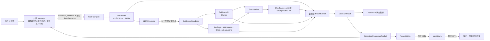

# Typed Proof Compiler vNext 冻结说明（2026-08-22）

> 状态：**代码形态冻结；0025 功能 Stop Gate 通过，但三案例迁移验收未通过。**
>
> 本文描述 2026-08-22 当前源码树中已经存在的边界与行为，并记录同一冻结候选上的 fresh 0025、0053、0006 真实模型运行。该结果证明单例闭环成立，但不能证明跨案例业务泛化已经完成。

## 1. 冻结结论

当前系统的主线不是“用 Python 写完企业审核规则”，而是把开放式证据审核变成一段可观察、可校验、可继续工作的 LLM 程序：



不可替代的 Compiler 价值在中间：Task Compiler 先把审核目标编译成有终止条件的 ProofPlan；Executor 在沙箱内自主取证；Verifier 对原子命题独立分类；Kernel 只接纳来源、类型、Policy 和可重放计算闭合的强结论。这样既保留 LLM 的业务语义自由度，也能定位问题究竟发生在 Plan、取证、语义绑定、计算、核验还是消费投影。

## 2. 范围与非目标

### 当前范围

- 面向当前 Invoice/AP Workbench 的付款材料证据审核。
- 外层 Manager 接收自然语言业务请求，决定活动 Requirement，组织 Advisor、Compiler、Patch、报告与用户交互。
- 内层 Compiler 对本轮活动 Requirement 生成一个 ProofPlan，并输出可追溯的三态 DecisionProof。
- 支持来源准入、逐字 quote/locator Claim、语义 Binding、Decimal Witness、Policy lineage、三态图传播、状态投影和报告边界。
- 保留共享 EvidenceIR；同一运行内已采纳的观察事实可供多个 CHECK 使用。
- 当前只输出证据状态，不输出正式付款 `APPROVE/REJECT`，也不执行 ERP 过账或付款。

### 明确非目标

- 不是已经完成的任意 ERP 通用审核产品。当前 Policy Pack、Requirement catalog、桌面文案和测试主体仍是发票/AP。
- 不是把每种业务写成专用 DAG；当前 Plan 拓扑由 Task Compiler 生成，代码只保留小型类型约束。
- 不是规则 DSL、图数据库、万能 Ontology，也不在本文设计新的 DSL。
- 不是零信任或恶意 Runtime 防护方案；当前完整性依赖可信本地 Runtime 与内容哈希。
- 不是人工审批替代品，也不允许报告把证据状态翻译成付款授权。

## 3. 两层职责：Manager 管工作，Compiler 管证明

### 外层 Manager

Manager 是用户入口和工作流控制面，负责：

- 理解“帮我审核这批付款材料”一类自然语言请求，而不是要求用户说出内部 Requirement ID。
- 检查附件、选择审核范围，并按需调用 `materials_advisor`、`evidence_reviewer`、`case_patch_writer`、`report_writer`。
- 向用户解释当前进度、缺口和报告路径。
- 对写 Markdown 与渲染 PDF 分别走 HITL approval。
- 只消费 canonical proof 投影；不自行创造 Claim、Proof status 或付款结论。

### 内层 Compiler

`evidence_reviewer` 对 Manager 保持原工具名，内部运行 `EvidenceCompilerRuntime`：

1. Task Compiler：Requirement + Policy + 来源目录/抽取摘要 → ProofPlan。
2. Executor：在证据沙箱中读源、绑定 Claim、提出 Binding、申请 Witness、提交 CHECK。
3. Fine Verifier：逐 CHECK 独立核验，给出三态与接纳的 proof-term refs。
4. Proof Kernel：校验哈希、来源、类型闭包、Policy 消费、Witness 重放和图传播。
5. CaseStore：原子接收 evidence patch + ReviewArtifact，再从 Kernel 结果投影 Requirement 状态。

这不是“两套 Manager”。外层 Manager 管用户任务和副作用；内层 Compiler 管一次证据证明程序。

## 4. Tiny ProofSignature：只定最低类型，不替 LLM 写 Plan

当前 `ProofSignature` 只有：

- `signature_id / version / requirement_id`
- 根组合语义：`ALL_REQUIRED | ANY_SUFFICIENT`
- 必须实际使用的 `required_policy_refs`
- 每个 facet 的最低 proof-term 类型：`CLAIM | BINDING | WITNESS`

`PlanConformanceGate` 只检查必需 facet 可达、根组合不可绕过、Policy ref 被 Plan 覆盖。它不决定 CHECK 数量、CHECK 文案、节点 ID、共享方式或 ALL/ANY 的具体嵌套。

Task Compiler 仍有以下自由：

- 按当前案件把目标拆成可分别支持、反驳或缺失的原子 CHECK。
- 决定 CHECK 的数量、措辞与组合结构。
- 让一个 CHECK 覆盖多个 facet，或把一个 facet 拆成多个 CHECK。
- 在不删除必需 facet 的前提下，发现材料暴露出的额外风险面。
- 在多个 Requirement 间复用真正相同的原子检查。

当前图节点只有 `CHECK | ALL | ANY`，没有 `NOT` 节点。当前 Policy Pack 仅为两个 Requirement 配置了 ProofSignature：

- `invoice_calculation_valid`：四个算术 facet，要求使用 `invoice_calculation_rounding_tolerance`。
- `template_match`：一个基线比较 facet，要求使用 `invoice_template_baseline_ref`。

因此不能声称所有 AP Requirement 都已经拥有同等强度的 typed proof 约束。

## 5. EvidenceIR 与四种 Proof Material

### Claim：来源观察

Claim 保存：`subject / predicate / value / source_id / quote / locator / confidence / attributes`。它只能表达来源中直接可观察的事实。

Claim 不得偷偷编码跨 Claim 关系、计算 operands、Binding 或 Witness。数值 Claim 还必须能在 exact quote 中找到对应的本地化数字。

### Binding：LLM 提出的业务语义关系

`SemanticBindingProposal` 把 Claim、Witness 或 Policy term 组织成某个 CHECK/facet 下的业务关系，例如“该税率适用于该税基”。它是模型提案，不是已接受事实，更不是 verdict；是否接纳由 Fine Verifier 决定。

### Witness：Runtime 生成的可重放计算

Executor 只能提交 operation 与 typed refs，不能提交计算值或结果。Runtime 使用 Decimal 引擎生成 `CalculationWitness`，记录 operands、结果、币种/单位、Evidence/Policy snapshot hash 与 lineage hash。Kernel 会递归重放 Witness，而不是相信模型在 prose 里做的心算。

### StrongStatusLink：Verifier 给计算结果赋业务极性

对于要求 Witness 的强结论，Verifier 使用 `StrongStatusLink {witness_id, true_status}` 说明“该 boolean Witness 为 true 时，对当前 CHECK 意味着 SUPPORTED 还是 CONTRADICTED”。Link 不携带公式、阈值或结果；Kernel 重放 Witness 后再推导实际强状态。

这四层的分工是：

```text
Claim   = 原文观察
Binding = LLM 提出的业务关系
Witness = Runtime 可重放的确定性计算
StrongStatusLink = Verifier 对 boolean 结果的业务极性解释
```

`EvidenceIR` 仍然存在，并保存 admitted source ids、source fingerprints 与共享 Claims。Binding、Witness、Assessment 和提交闭包则随 `ReviewArtifact` 保存，避免把“观察事实”和“本轮证明工作”混成一层。

## 6. 沙箱与 focused 事务修复

Executor 只有五个工具：

1. `list_sources`
2. `read_source`
3. `bind_claim`
4. `compute_witness`
5. `submit_check`

沙箱不开放文件系统、Shell、Python、Policy 修改或 CaseStore 写入。关键 Hook 包括：

- 未 `read_source` 不能 `bind_claim`。
- quote 必须是来源内容或系统 provenance 的 exact substring。
- locator 必须有效；数值必须与 quote 中的数值一致。
- Witness 只能引用 admitted Claim、先前 Witness 或本 CHECK 已配置的 Policy term。
- `submit_check` 只提交 proof material 与未决问题，不提交 verdict。

当 Kernel 发现所有者明确的局部缺口时，Runtime 可以发起 bounded focused repair。实现会：

- 深拷贝当前 sandbox；
- 冻结非目标 CHECK 的写入；
- 要求新增 Claim/Binding/Witness 必须能从 focused CHECK 的新 submission 到达；
- 越界或出现孤儿 proof material 时整体丢弃 candidate；
- 只有重新 Executor → Verifier → Kernel 成功后才提交该 candidate。

当前 Runtime 对不同所有者问题有各自的一次性修复路径，例如 Verifier 极性错误和 Executor 缺 terminal Witness；还可能在 blocking `NOT_FOUND` 后做受限补证。因此它是“按问题类型有账本的有限循环”，不是“整次运行绝对只 retry 一次”，也不是无界自我修复。

## 7. Fine Verifier 与业务盲 Kernel

### Fine Verifier 做什么

- 对每个原子 CHECK 分别输出 `SUPPORTED | CONTRADICTED | NOT_FOUND`。
- 重新检查 Claim 的 quote 是否真的支持 predicate/value。
- 决定是否接受 Binding 与 Witness refs。
- 对强 Witness 结论输出 StrongStatusLink。
- 强结论前必须检查完整 admitted source snapshot；缺失、部分、歧义、冲突或 Policy 未配置均返回 `NOT_FOUND`。

### Kernel 做什么

- 校验 Artifact、Plan、ProofSignature、Evidence 与 Policy 的 hash/lineage。
- 拒绝悬空引用、跨 CHECK 借用、低置信度强结论、不完整来源覆盖和未闭合 proof terms。
- 重放 Witness，并校验 StrongStatusLink 与实际 boolean 极性。
- 要求 CHECK 声明的 Policy 不只出现在 Plan 中，还必须被该强结论接纳的 Binding/Witness 闭包实际消费。
- 用固定三态逻辑传播 CHECK → root → DecisionProof。

Kernel 不判断“谁是供应商”“这个税率属于哪个税基”“两笔付款是否同一债务”；这些仍由 LLM 的 Claim/Binding/Assessment 工作完成。Kernel 只判断模型提交的工作是否满足可追溯、可重放、类型与逻辑边界，所以这里的“业务盲”不等于“没有约束”。

## 8. 三态与 NOT_FOUND 传播

原子状态只有：

- `SUPPORTED`：当前 admissible proof closure 足以直接支持 CHECK。
- `CONTRADICTED`：当前 admissible proof closure 足以直接反驳 CHECK。
- `NOT_FOUND`：无法得到任一强结论，包括缺失、部分、歧义、冲突、未配置 Policy 或完整性失败。

聚合规则：

| 节点 | SUPPORTED | CONTRADICTED | NOT_FOUND |
|---|---|---|---|
| `ALL` | 全部子节点 SUPPORTED | 任一子节点 CONTRADICTED | 其余情况 |
| `ANY` | 任一子节点 SUPPORTED | 全部子节点 CONTRADICTED | 其余情况 |

Kernel 可以把 Verifier 的强结论降级为 `NOT_FOUND`，但不会因为“看起来差不多”把 `NOT_FOUND` 升级为强结论。当前图没有 `NOT` 节点，负命题必须直接写成可核查的 CHECK。

## 9. Policy 必须被实际消费

当前链路对 Policy 有三道不同检查：

1. `policy_excerpt_for()` 只给活动 Requirement 提供其声明需要的 Policy，并明确 configured/unconfigured。
2. ProofPlan 必须覆盖相关 Policy ref；沙箱只允许本 CHECK 使用已声明且 configured 的 typed `POLICY` ref。
3. Kernel 要求强结论的接纳闭包实际包含该 Policy term；只在 Prompt、CHECK 文案或 Plan 列表中提到它不算消费。

例如当前 `invoice_calculation_valid` 的 signature 要求 `invoice_calculation_rounding_tolerance`；其配置值是文档币种下的绝对 `0.01` 舍入容差。对应 terminal Witness 的 lineage 必须真正引用该 Policy。`invoice_template_baseline_ref` 当前未配置，因此相关 CHECK 应保持 `NOT_FOUND`，模型不能猜基线。

Policy Pack 顶部还存在三单金额百分比等 AP 字段，但这不代表所有值已被每个强结论 typed-consume；是否实际消费必须以 Artifact 的 accepted proof closure 为准。

## 10. CanonicalConsumerPacket 与报告边界

`CanonicalConsumerPacket` 是从 `ReviewArtifact + CompiledProof` 派生的只读消费投影，不是 CaseState 的第二份真相。它只携带消费者需要的：lineage、root decisions、leaf findings、obligations，以及被这些 finding 实际引用的 Claim/Binding/Witness/source fingerprint。

报告等级：

- `FULL`：执行完成、完整性未拒绝、所有 required root/leaf 都是强状态，且没有 required blocking obligation。
- `PARTIAL`：存在可报告的 Kernel-accepted 强 leaf finding，但整案尚未达到 FULL；只能报告局部发现。
- `NONE`：完整性拒绝、执行失败，或没有任何可报告的强 leaf finding。

Report Writer 当前只接收 `canonical_consumer_packet + user_request`。生成 Markdown 后，`finalize_consumer_report()` 会：

- 拒绝 `NONE`；
- 校验报告中的 proof ID、状态与业务数值必须能投影回 packet；
- 拒绝把 proof 写成付款/过账/正式批准；
- 对 `PARTIAL` 拒绝整案已完成的过强表述，并追加确定性的部分审查边界。

报告 projection validator 已在当前源码中接入 finalizer，并有 focused tests。fresh 0025 已真实通过 Markdown 写入和 PDF 渲染；同一批迁移运行中的 0006 仍未完成报告写盘，因此这里只能确认 0025 链路，不能把报告 E2E 宣称为跨案例通过。

## 11. HITL、PDF 与原始材料附录

- `write_case_file` 与 `render_pdf` 都是 `local_write`，approval mode 均为 `always`；两步分别需要 HITL。
- 默认报告流程是 Report Writer → 写 Markdown → 渲染 PDF；用户明确只要 Markdown 时可不生成 PDF。
- canonical conclusion validator 运行在 Report Writer 的 Markdown 上。
- PDF Renderer 在正文完成后，才把字段截图和原始文件快照追加到“原始材料附录”。附录固定声明：`仅供人工核对，不构成系统结论；以正文 canonical Proof 为准。`

因此 PDF 原始材料附录是给人复核的展示层，不是绕过 CanonicalConsumerPacket 给 Report Writer补充结论的第二条证据通道，也不应参与 canonical 业务结论评分。

## 12. Business Eval 与 Framework Eval 必须分开

### Business Eval

验证模型是否真的完成业务：

- 自然语言任务理解与目标 Requirement/root；
- 必要事实、来源、quote/locator 与语义里程碑；
- Claim/Binding/Witness 的业务关系；
- 目标三态、Requirement 投影、认知边界；
- 报告事实、业务含义与中文用户沟通。

当前业务评分器版本为 `business_eval_scorer_v2.6`，业务通过要求无 veto、无核心失败且得分至少 90。

### Framework Eval

验证运行协议是否健康：

- 必需/禁止的工具和角色；
- HITL approvals；
- 调用顺序；
- 最大工具错误与总调用预算。

Framework 分数单独展示，不计入业务 100 分。启用 Framework oracle 时，总体通过需要业务与 Framework 都通过。Framework 通过不能修复错误的业务真值；业务判断正确也不能豁免安全/流程协议。定向 repair queue 只使用 dev suites，holdout 不生成定向调优建议。

## 13. 当前版本与 Prompt tags（以代码为准）

本文不手填一个独立“最新版本真相”。运行和 trace 必须从源码常量/role capability 读取当前 tag：

| 组件 | 2026-08-22 当前源码值 | 权威位置 |
|---|---|---|
| Manager | `supervisor_planner_v2.4_native_tools` | `backend/app/runtime/turn_runner.py` |
| Compiler Runtime | `typed_evidence_compiler_runtime_v8` | `backend/app/compiler_runtime/runtime.py` |
| Task Compiler prompt | `typed_task_compiler_v10` | `backend/app/compiler_runtime/runtime.py` |
| Executor prompt | `typed_evidence_executor_v8` | `backend/app/compiler_runtime/runtime.py` |
| Fine Verifier prompt | `typed_fine_verifier_v13` | `backend/app/compiler_runtime/runtime.py` |
| Report Writer capability | `report_writer_v7+global_policy_v1.2+canonical_consumer_v1+pdf_skill_v4` | `backend/app/agents/capabilities.py` |
| Business scorer | `business_eval_scorer_v2.6` | `backend/app/evals/business/scorer.py` |
| Policy Pack | `aurora_ap_lite_v1` / Requirement Pack `aurora_requirement_pack_v1` | `policies/aurora_ap_policy_v1.json` |

若代码 tag 改变，应由新的运行 trace 记录新值；不要只改本文来伪装版本已升级。

## 14. 历史真实 0025：只能作为修复前证据

案例 `invoice_total_conflict_0025@1` 的以下运行发生在本次 vNext 冻结之前，只能说明当时存在什么问题：

| 历史目录 / Run | 结果 | 可证明的问题 | 不能证明的事 |
|---|---:|---|---|
| `o/v25closure/20260821T184709_165482Z` | Business `59/100`, VETO；Framework `91.67/100`, FAIL | target DecisionProof 为 `NOT_FOUND`，Oracle 要求 `CONTRADICTED`；存在 terminal Witness/closure、报告和工具错误问题 | 不能证明当前 vNext 失败或通过 |
| `o/v25second/20260821T192816_923579Z` | Business `76.5/100`, VETO；Framework `91.67/100`, FAIL | 报告阶段已有改进，但仍有 evidence boundary 越权、多个本应强结论的算术 milestone 为 `NOT_FOUND`、缺 Witness 关系和 1 个工具错误 | 不能作为 fresh vNext 验收结果 |

两次历史运行都没有通过。它们的价值是形成回归问题清单，不是给当前实现背书。

## 15. Fresh vNext 验收结果

> 以下三例均为可调优的 `atomic_dev`，不是 holdout。运行使用同一冻结候选；snapshot 记录的 base commit 为 `13381ae05f26971f433bff2f8cccd8d8a8c256b4`，同时包含当时尚未提交的当前工作树改动。因此该 SHA 只能用于定位基线，不能单独重建本次运行。

共同运行配置：provider/model 为 `deepseek/deepseek-v4-flash`；Compiler `typed_evidence_compiler_runtime_v8`；Task Compiler `typed_task_compiler_v10`；Executor `typed_evidence_executor_v8`；Verifier `typed_fine_verifier_v13`；Business scorer `business_eval_scorer_v2.6`。

| 案例 / fresh run | Oracle / canonical target | Business | Framework | 报告与 Runtime | 冻结判断 |
|---|---|---:|---:|---|---|
| `0025` / `run_eval_20260821T205946_897899Z` | `CONTRADICTED / CONTRADICTED` | `69.89`, FAIL，0 veto | `91.67`, FAIL | Runtime `COMPLETED`；`write_case_file`、`render_pdf` 两次审批；MD/PDF 均生成 | **功能 Stop Gate 通过**，不追 100 分 |
| `0053` / `run_eval_20260821T210527_846077Z` | `NOT_FOUND / 无 DecisionProof` | `6.00`, FAIL；`TARGET_DECISION_MISMATCH`、`PROOF_INTEGRITY_MISMATCH` | `33.32`, FAIL | evidence_reviewer 结构校验失败；无 Artifact、报告和审批 | **迁移失败，但安全 fail-closed** |
| `0006` / `run_eval_20260821T211032_917646Z` | `CONTRADICTED / CONTRADICTED` | `59.83`, FAIL，0 veto | `58.31`, FAIL | Compiler 完成；只批准 write，MD/PDF 未落盘；用户收到安全失败回复 | **根标签命中，但业务路径与交付迁移失败** |

### 0025 Stop Gate

- 业务根结论正确：`invoice_calculation_valid=CONTRADICTED`。
- False Strong 为 0；`stated_components_check` 的证据闭包不足时保留 `NOT_FOUND`，没有被升级。
- Kernel 接纳并重放：重算总额 `13,563.84 EUR`、票面总额 `13,156.92 EUR`、差额 `406.92 EUR`、容差 `0.01 EUR` 的 terminal Witness 链。
- Report Writer 只接收 CanonicalConsumerPacket；Markdown 正文通过 projection validator；PDF 原始截图只出现在带免责声明的附录。
- Markdown/PDF 均生成，两个本地写入分别获得 approval；Runtime 无 `RUN_FAILED`，最终中文回复包含报告路径和冲突摘要。
- 该例仍有 17 次工具拒绝、50 次 provider call、738,006 API tokens、约 289 秒耗时；Framework 因 `max_tool_errors=0` 未通过。最终短回复未重复三个关键金额，报告也未逐项重复小计/VAT，故 Business 未达 90。这些保留为下一版本诊断，不作为继续打磨 0025 的理由。
- TXT 中共有 50 个调用记录，与 snapshot `engineering.provider_calls=50` 一致；usage 取 snapshot 聚合值。本轮未建立独立外部计费对账。

### 跨案例迁移结论

- `0053` 没有走到“应为 NOT_FOUND 的基数判断”这一层：附件读取后，evidence_reviewer 多轮尝试最终未产出 schema-valid ReviewArtifact。系统没有写入 Claim 或强结论，这是安全行为，但运行稳定性不合格。
- `0006` 正确抓到打印小计冲突，根状态也命中 `CONTRADICTED`；但 `check_final_total` 仍复用错误的打印小计并给出第二个冲突，没有把 line-derived total 与 printed-subtotal path 完整分开。报告写盘也失败。因此不能用根标签命中声称业务推理通过。
- 结论是：**Typed Compiler 的结构边界和 0025 单例闭环成立；跨案例的 Task Compiler 数据流拆解、Executor 结构化稳定性、工具纪律和报告终态仍未达到业务 benchmark 发布门槛。**
- 下一版本只按跨案例根因处理，不再逐案调整 0025：优先观察 schema-valid Artifact 产出率、打印值与派生值的数据流隔离、报告写盘成功率，以及工具拒绝/调用预算。修复后必须用未参与规则调节的新 snapshot/holdout 验证。

## 16. 已知威胁与边界

### 可信 Runtime seal

`ReviewArtifact.artifact_hash` 是对内容的稳定哈希；Kernel 还检查 Plan、Evidence、ProofSignature、Policy 和来源指纹。CaseStore 只在当前活动 Requirement、来源 fingerprint 与 Policy hash 匹配时重放 Artifact。

但这不是外部签名或硬件信任根。能任意修改本地 Artifact 且能重新计算 hash 的恶意调用者仍可“重新封印”内容。因此当前保证是：在可信 Runtime/CaseStore 正常路径中发现陈旧或意外篡改；不是抵御已控制 Runtime 的攻击者。

### 当前产品边界

- 桌面端标题和交互仍是 `Invoice Agent Workbench`；Policy/Requirement pack 是 Aurora AP demo。
- Compiler 的抽象可承载更多证据任务，不等于任意 ERP 领域已经完成建模、Policy 接入、来源适配、UI 与 benchmark。
- 当前正式输出是 evidence review/report，不是 ERP execution 或企业审批授权。

### 报告投影边界

- `validate_canonical_report_projection()` 当前已实现，并由 `finalize_consumer_report()` 调用。
- focused tests 当前存在于 `backend/tests/test_report_output_projection.py` 与 `backend/tests/test_compiler_consumer_packet.py`。
- fresh 0025 已验证 Report Writer 输出、content_ref finalization、Markdown 写入、PDF 渲染和原始材料附录共同保持边界；0006 同时证明报告终态尚未跨案例稳定。

## 17. 冻结后的判断标准

后续修改不应以“新增更多类或 DAG”为完成标准，而应回答同一个问题：

> 同一模型在同一业务材料上，经过 ProofPlan、证据沙箱、Fine Verifier 和业务盲 Kernel 后，是否比直接 Reviewer 更少强结论错误、更可追溯、更容易定位失败，同时成本仍可接受？

只有 fresh Business Eval、Framework Eval、trace 对账和人工报告复核共同给出证据后，才能把本冻结状态升级为“已验收”。
